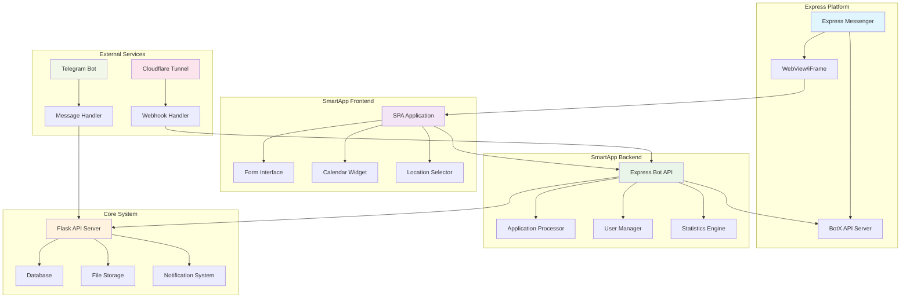
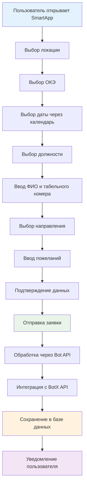

# 🚀 Express Bot - Полное руководство

## 📋 Обзор системы

**Express Bot** - это комплексная система для подачи заявок на командировочные рейсы, состоящая из чат-бота и SmartApp для Express Messenger. Система реализует полный цикл работы с заявками от создания до обработки.

---

## 🏗️ Архитектура системы



---

## 🎯 Основные компоненты

### 🤖 Express SmartApp Bot
- **Файл:** `express_smartapp_bot.py`
- **Порт:** 5006
- **Функции:**
  - Обработка заявок через Bot API
  - Интеграция с BotX API
  - Управление пользовательскими сессиями
  - Статистика и аналитика

### 📱 Frontend SPA
- **Файл:** `express_smartapp_frontend.html`
- **URL:** `http://localhost:5006/`
- **Функции:**
  - Адаптивный интерфейс для WebView
  - Форма подачи заявок
  - Интерактивный календарь
  - Выбор локаций и ОКЭ

### 🔧 Flask API Server
- **Порт:** 5002
- **Функции:**
  - Основной API для обработки данных
  - Управление базой данных
  - Файловое хранилище
  - Система уведомлений

### 🌐 Cloudflare Tunnel
- **URL:** `https://comparing-doom-solving-royalty.trycloudflare.com`
- **Функции:**
  - Публичный доступ к локальному серверу
  - Webhook для Express
  - SSL-шифрование

---

## 🔄 Процесс работы с заявками



---

## 📊 Возможности системы

### ✨ Основные функции

| Функция | Описание | Статус |
|---------|----------|--------|
| **📝 Подача заявок** | Полный цикл создания заявки | ✅ |
| **📅 Интерактивный календарь** | Выбор даты с навигацией | ✅ |
| **🏢 Выбор локаций** | Москва, СПб, Красноярск, Сочи | ✅ |
| **🏭 Выбор ОКЭ** | По локациям с валидацией | ✅ |
| **👔 Выбор должностей** | БП, РП, Специалист, Эксперт | ✅ |
| **✈️ Направления** | Из списка или ручной ввод | ✅ |
| **💾 Сохранение данных** | Последние данные пользователя | ✅ |
| **📋 Просмотр заявок** | История заявок пользователя | ✅ |
| **📊 Статистика** | Аналитика по заявкам | ✅ |

### 🔧 Технические возможности

- **🔄 Асинхронная обработка** - неблокирующие операции
- **🔐 Безопасность** - токены авторизации и шифрование
- **📱 Адаптивность** - работа на всех устройствах
- **🌐 Масштабируемость** - поддержка множества пользователей
- **📝 Логирование** - полное отслеживание операций
- **🔧 Мониторинг** - health checks и метрики

---

## 🚀 Быстрый старт

### 1. Запуск системы

```bash
# Переход в директорию
cd /root/test/express_bot

# Запуск всех сервисов
./manage_all.sh start

# Запуск Express SmartApp
./start_express_smartapp_correct.sh
```

### 2. Проверка статуса

```bash
# Проверка Flask API
curl http://localhost:5002/health

# Проверка SmartApp
curl http://localhost:5006/health

# Проверка Frontend
curl http://localhost:5006/
```

### 3. Тестирование

```bash
# Комплексное тестирование
python3 test_bot.py

# Проверка результатов
cat bot_test_results.json | jq
```

---

## 📁 Структура проекта

```
express_bot/
├── 🤖 Backend Components
│   ├── express_smartapp_bot.py      # SmartApp Backend
│   ├── express_bot.py               # Telegram Bot
│   ├── express_bot_webhook.py       # Webhook Handler
│   └── express_bot_config.py        # Configuration
│
├── 📱 Frontend Components
│   ├── express_smartapp_frontend.html  # SPA Interface
│   ├── frontend/                      # Frontend Assets
│   └── static/                        # Static Files
│
├── 🔧 Scripts & Tools
│   ├── start_express_smartapp_correct.sh  # Launch Script
│   ├── manage_all.sh                      # Service Manager
│   ├── test_bot.py                        # Testing Suite
│   └── check_integration_ready.sh         # Integration Check
│
├── 📊 Data & Logs
│   ├── logs/                           # Application Logs
│   ├── data/                           # Data Storage
│   └── config/                         # Configuration Files
│
└── 📚 Documentation
    ├── Express_Bot_Complete_Guide.md   # This Guide
    ├── README.md                       # Basic Documentation
    └── EXPRESS_SMARTAPP_FINAL_STATUS.md # Status Report
```

---

## 🔗 API Endpoints

### SmartApp Bot API

| Endpoint | Method | Description | Response |
|----------|--------|-------------|----------|
| `/api/smartapp/info` | GET | Bot information | Bot details |
| `/api/smartapp/submit` | POST | Submit application | Success/Error |
| `/api/smartapp/applications/<user_id>` | GET | User applications | Applications list |
| `/api/smartapp/periods` | GET | Application periods | Periods list |
| `/api/smartapp/statistics` | GET | Statistics | Analytics data |
| `/health` | GET | Health check | System status |

### Flask API

| Endpoint | Method | Description | Response |
|----------|--------|-------------|----------|
| `/api/applications` | POST | Create application | Application ID |
| `/api/applications/<id>` | GET | Get application | Application data |
| `/api/users/<id>/applications` | GET | User applications | Applications list |
| `/api/statistics` | GET | System statistics | Analytics data |
| `/health` | GET | Health check | System status |

---

## 🔐 Безопасность и авторизация

### Токены и ключи

```python
# Express Bot Configuration
EXPRESS_BOT_CONFIG = {
    'bot_id': '00c46d64-1127-5a96-812d-3d8b27c58b99',
    'secret_key': 'a75b4cd97d9e88e543f077178b2d5a4f',
    'bot_token': 'mock_bot_token',  # В продакшене - реальный токен
    'express_token': 'mock_express_token'
}
```

### Шифрование

- **HTTPS** для всех внешних соединений
- **JWT токены** для авторизации
- **CORS** настройки для безопасности
- **Валидация** всех входящих данных

---

## 📊 Мониторинг и логирование

### Логи системы

```bash
# Основные логи
tail -f logs/express_smartapp_bot.log
tail -f logs/flask_api.log
tail -f logs/telegram_bot.log

# Поиск ошибок
grep -i error logs/*.log
grep -i exception logs/*.log
```

### Метрики производительности

```bash
# Использование ресурсов
top -p $(pgrep -f express_smartapp)
htop

# Сетевая активность
netstat -tlnp | grep -E "(5002|5006)"
ss -tulpn | grep -E "(5002|5006)"
```

### Health Checks

```bash
# Проверка всех сервисов
curl -s http://localhost:5002/health | jq
curl -s http://localhost:5006/health | jq
curl -s https://comparing-doom-solving-royalty.trycloudflare.com/health | jq
```

---

## 🐛 Устранение неполадок

### Частые проблемы

#### ❌ Сервис не запускается
```bash
# Проверка портов
netstat -tlnp | grep -E "(5002|5006)"

# Проверка процессов
ps aux | grep -E "(flask|express|smartapp)"

# Перезапуск
./manage_all.sh stop
./manage_all.sh start
```

#### ❌ Frontend не загружается
```bash
# Проверка файлов
ls -la express_smartapp_frontend.html
ls -la static/

# Проверка прав доступа
chmod 644 express_smartapp_frontend.html
```

#### ❌ API недоступен
```bash
# Проверка конфигурации
python3 express_bot_config.py

# Проверка зависимостей
pip list | grep -E "(flask|requests|pybotx)"
```

### Диагностика

```bash
# Полная диагностика системы
./check_integration_ready.sh

# Проверка конфигурации
python3 -c "from express_bot_config import validate_config; print('OK' if validate_config() else 'ERROR')"

# Тест API
curl -X POST http://localhost:5006/api/smartapp/submit \
  -H "Content-Type: application/json" \
  -d '{"form_data":{"location":"Москва"},"user_context":{"user_id":"test"}}'
```

---

## 🔄 Интеграция с Express

### Настройка WebView

```javascript
// Конфигурация для Express WebView
const webViewConfig = {
    url: 'http://localhost:5006/',
    width: '100%',
    height: '600px',
    sandbox: 'allow-scripts allow-same-origin',
    features: ['camera', 'microphone']
};
```

### BotX API интеграция

```python
# Пример интеграции с BotX API
def send_to_botx_api(endpoint, data):
    url = f"{BOTX_URL}/{endpoint}"
    headers = {
        'Authorization': f'Bearer {BOT_TOKEN}',
        'Content-Type': 'application/json'
    }
    response = requests.post(url, json=data, headers=headers)
    return response.json()
```

---

## 📈 Производительность и оптимизация

### Рекомендации по производительности

1. **Кэширование** - Redis для сессий и данных
2. **CDN** - для статических файлов
3. **База данных** - индексы и оптимизация запросов
4. **Мониторинг** - метрики и алерты
5. **Масштабирование** - горизонтальное масштабирование

### Настройки для продакшена

```python
# Production Configuration
PRODUCTION_CONFIG = {
    'debug': False,
    'log_level': 'WARNING',
    'max_connections': 1000,
    'timeout': 30,
    'retry_attempts': 3,
    'cache_ttl': 3600
}
```

---

## 🧪 Тестирование

### Автоматические тесты

```bash
# Запуск всех тестов
python3 test_bot.py

# Результаты тестирования
cat bot_test_results.json | jq '.results[] | select(.status == "PASS")'
```

### Ручное тестирование

1. **Frontend тестирование**
   - Открыть `http://localhost:5006/`
   - Проверить все формы и кнопки
   - Тестировать на разных устройствах

2. **API тестирование**
   - Тестировать все endpoints
   - Проверить обработку ошибок
   - Тестировать с разными данными

3. **Интеграционное тестирование**
   - Полный цикл подачи заявки
   - Проверка уведомлений
   - Тестирование с реальными данными

---

## 📚 Дополнительные ресурсы

### Документация

- [Express Platform Docs](https://docs.express.ms/)
- [BotX API Reference](https://docs.express.ms/botx-api/)
- [SmartApp Guidelines](https://docs.express.ms/smartapps/)

### Полезные команды

```bash
# Быстрая проверка системы
curl -s http://localhost:5006/health && echo " ✅ SmartApp OK" || echo " ❌ SmartApp Error"

# Мониторинг в реальном времени
watch -n 5 'curl -s http://localhost:5006/health | jq'

# Бэкап конфигурации
tar -czf backup_$(date +%Y%m%d).tar.gz config/ logs/

# Очистка логов
find logs/ -name "*.log" -mtime +7 -delete
```

---

## 🏷️ Теги и категории

#express #bot #smartapp #api #frontend #backend #telegram #flask #python #javascript #webview #botx #integration #documentation #guide

---

## 📞 Поддержка

### Контакты
- **Разработчик:** AI Assistant
- **Версия:** 1.0.0
- **Дата создания:** 2025-01-27
- **Статус:** ✅ Готов к продакшену

### Полезные ссылки
- [GitHub Repository](#)
- [Issue Tracker](#)
- [Documentation](#)
- [API Reference](#)

---

*Последнее обновление: $(date)*  
*Версия документации: 1.0*  
*Статус проекта: ✅ Активный*


