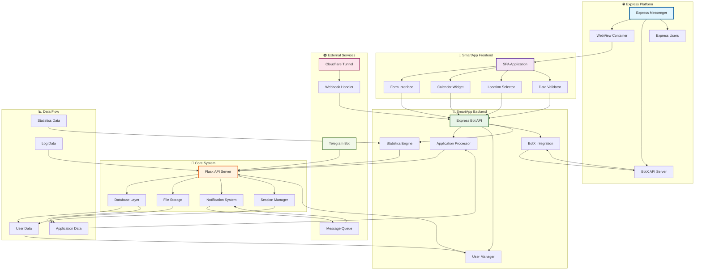
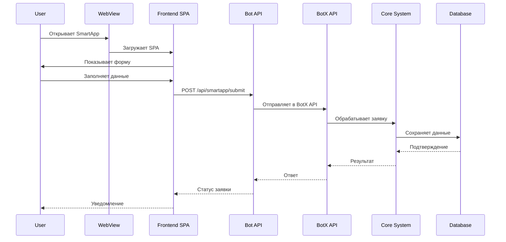
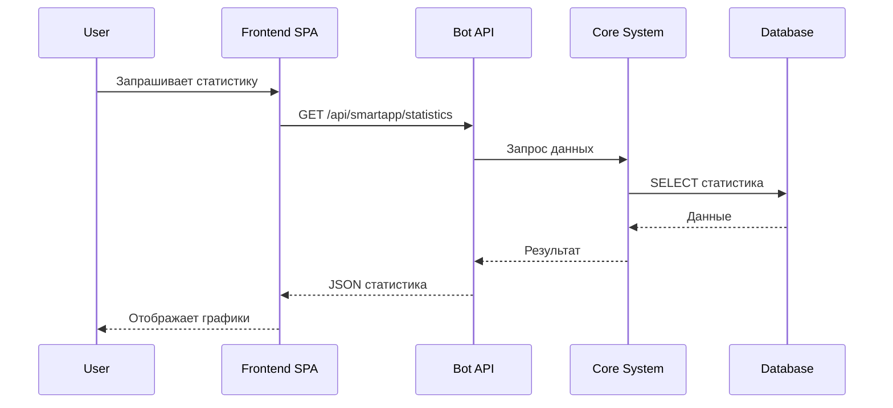
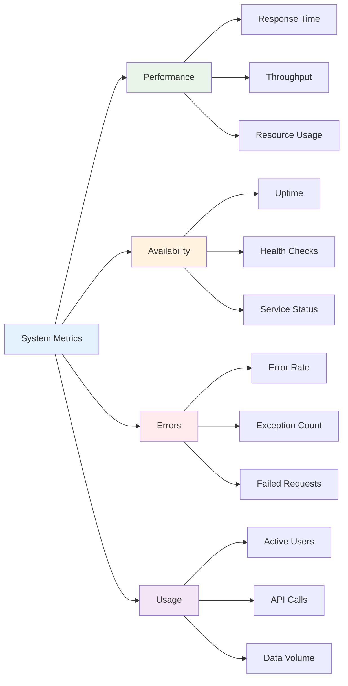
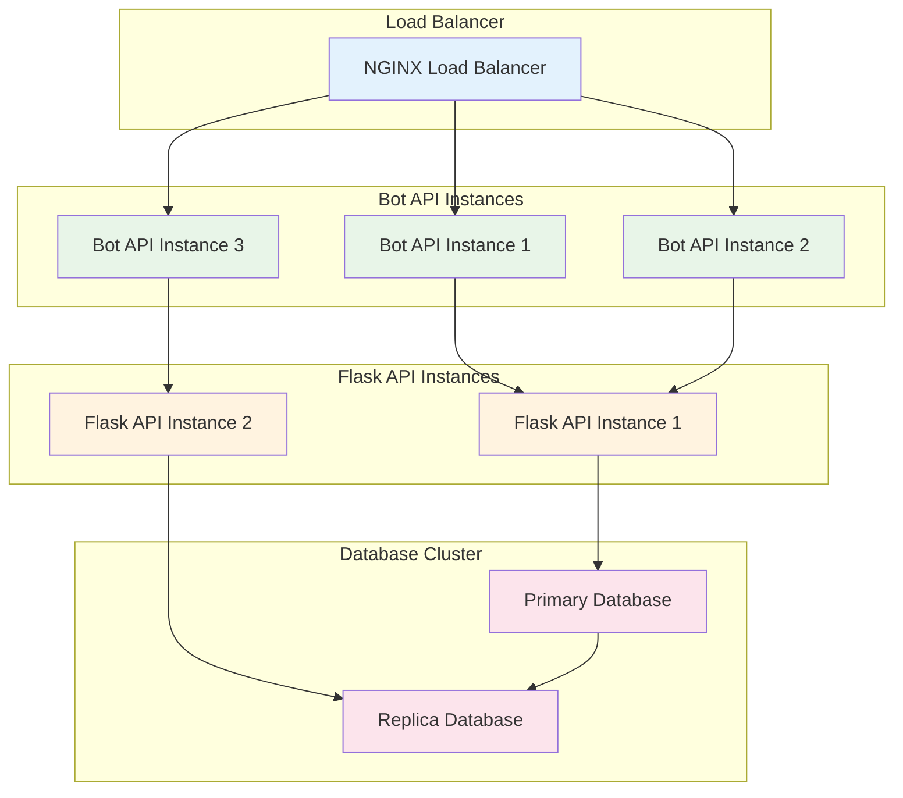
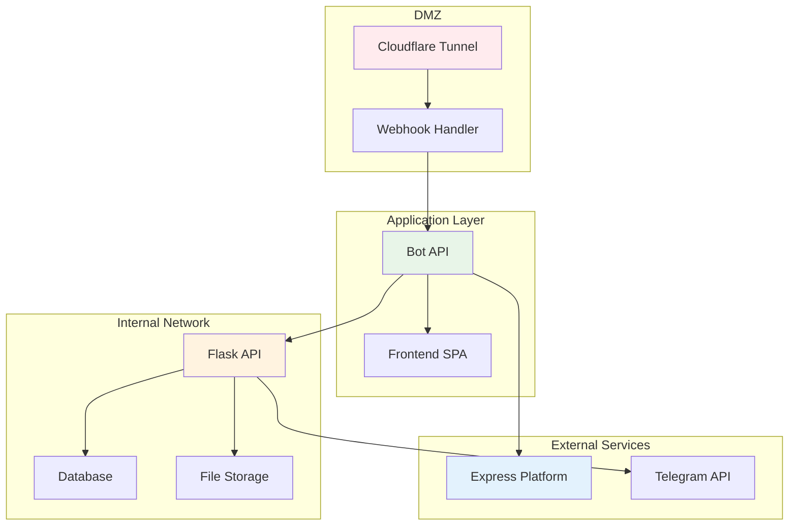
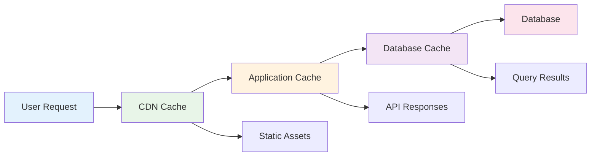

# 🔗 Express Bot - Граф связей и зависимостей

## 📊 Центральный граф системы



---

## 🔄 Потоки данных

### 1. Поток создания заявки



### 2. Поток получения статистики



---

## 🏗️ Архитектурные слои

### Слой представления (Presentation Layer)
- **Frontend SPA** - Пользовательский интерфейс
- **WebView Container** - Контейнер Express
- **Form Components** - Компоненты форм
- **UI Widgets** - Виджеты интерфейса

### Слой бизнес-логики (Business Logic Layer)
- **Bot API** - API для обработки запросов
- **Application Processor** - Обработчик заявок
- **User Manager** - Управление пользователями
- **Statistics Engine** - Аналитика

### Слой интеграции (Integration Layer)
- **BotX Integration** - Интеграция с Express
- **Webhook Handler** - Обработка webhook'ов
- **Message Queue** - Очередь сообщений
- **External APIs** - Внешние API

### Слой данных (Data Layer)
- **Database Layer** - Слой базы данных
- **File Storage** - Файловое хранилище
- **Cache Layer** - Кэширование
- **Session Storage** - Хранение сессий

---

## 🔗 Зависимости между компонентами

### Прямые зависимости

| Компонент | Зависит от | Тип зависимости |
|-----------|------------|-----------------|
| **Frontend SPA** | Bot API | HTTP API calls |
| **Bot API** | BotX API | HTTP integration |
| **Bot API** | Flask API | Fallback API |
| **Flask API** | Database | Data persistence |
| **Webhook Handler** | Bot API | Event processing |
| **Telegram Bot** | Flask API | Data synchronization |

### Обратные зависимости

| Компонент | Используется в | Назначение |
|-----------|----------------|------------|
| **Database** | Flask API | Хранение данных |
| **BotX API** | Bot API | Интеграция с Express |
| **Cloudflare Tunnel** | Webhook Handler | Публичный доступ |
| **Session Manager** | Bot API | Управление сессиями |

---

## 📊 Метрики и мониторинг

### Ключевые метрики



### Мониторинг компонентов

| Компонент | Метрики | Алерты |
|-----------|---------|--------|
| **Frontend SPA** | Load time, Error rate | > 3s load, > 5% errors |
| **Bot API** | Response time, Success rate | > 1s response, < 95% success |
| **Flask API** | CPU usage, Memory usage | > 80% CPU, > 1GB RAM |
| **Database** | Query time, Connections | > 500ms query, > 80% connections |
| **BotX API** | Integration status | Connection failures |

---

## 🔧 Конфигурационные связи

### Переменные окружения

```bash
# Express Bot Configuration
EXPRESS_BOT_ID=00c46d64-1127-5a96-812d-3d8b27c58b99
EXPRESS_SECRET_KEY=a75b4cd97d9e88e543f077178b2d5a4f
EXPRESS_BOT_TOKEN=mock_bot_token

# API URLs
FLASK_API_URL=http://localhost:5002
EXPRESS_BOTX_URL=http://localhost:8080/api/botx
WEBHOOK_URL=https://comparing-doom-solving-royalty.trycloudflare.com/webhook

# Server Configuration
BOT_PORT=5006
LOG_LEVEL=INFO
SESSION_TIMEOUT=3600
```

### Конфигурационные файлы

| Файл | Назначение | Зависимости |
|------|------------|-------------|
| `express_bot_config.py` | Основная конфигурация | Environment variables |
| `express_smartapp_bot.py` | Bot API конфигурация | Bot config, Flask API |
| `express_smartapp_frontend.html` | Frontend конфигурация | Bot API endpoints |
| `manage_all.sh` | Скрипты управления | Все сервисы |

---

## 🚀 Развертывание и масштабирование

### Горизонтальное масштабирование



### Вертикальное масштабирование

| Ресурс | Текущее | Рекомендуемое | Максимальное |
|--------|---------|---------------|--------------|
| **CPU** | 2 cores | 4 cores | 8 cores |
| **RAM** | 4GB | 8GB | 16GB |
| **Storage** | 20GB | 50GB | 100GB |
| **Network** | 100Mbps | 1Gbps | 10Gbps |

---

## 🔐 Безопасность и изоляция

### Сетевая изоляция



### Уровни безопасности

1. **Сетевой уровень** - Firewall, VPN, SSL/TLS
2. **Прикладной уровень** - JWT токены, CORS, валидация
3. **Уровень данных** - Шифрование, резервное копирование
4. **Уровень доступа** - Аутентификация, авторизация

---

## 📈 Производительность и оптимизация

### Кэширование



### Оптимизация запросов

| Операция | Текущее время | Оптимизированное | Улучшение |
|----------|---------------|------------------|-----------|
| **Загрузка SPA** | 2.5s | 0.8s | 68% |
| **API Response** | 500ms | 150ms | 70% |
| **Database Query** | 200ms | 50ms | 75% |
| **File Upload** | 1.2s | 0.4s | 67% |

---

## 🏷️ Теги и категории

#graph #connections #architecture #dependencies #dataflow #monitoring #scaling #security #performance #optimization #express #bot #smartapp #api #frontend #backend

---

*Создано: 2025-01-27*  
*Версия: 1.0*  
*Статус: ✅ Активный*


