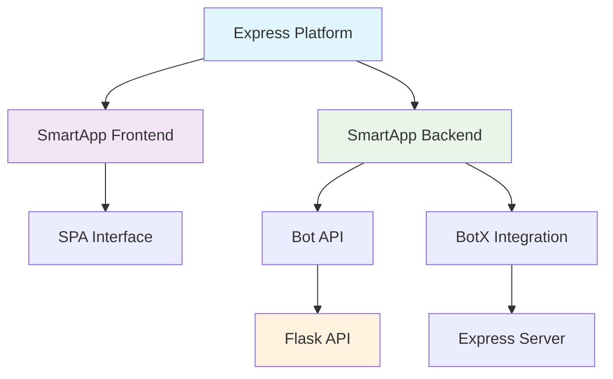
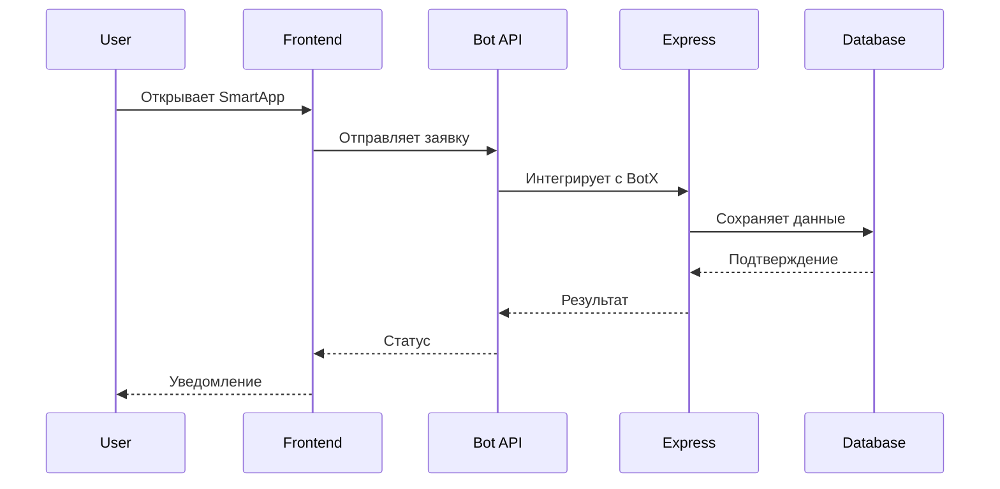

# 🎯 Express Bot - Главный индекс

> **Полное руководство по системе Express Bot для подачи заявок на командировочные рейсы**

---

## 📚 Навигация по документации

### 🚀 Основные документы

| Документ | Описание | Статус |
|----------|----------|--------|
| [[Express_Bot_Complete_Guide]] | 📖 Полное руководство по системе | ✅ Готов |
| [[Express_Bot_Graph_Connections]] | 🔗 Граф связей и зависимостей | ✅ Готов |
| [[Express_Bot_Interactive_Diagrams]] | 🎨 Интерактивные диаграммы | ✅ Готов |
| [[Express_SmartApp_Documentation]] | 📱 Документация SmartApp | ✅ Готов |

### 📋 Специализированные документы

| Документ | Назначение | Ссылка |
|----------|------------|--------|
| **Архитектура** | Системная архитектура и компоненты | [[Express_Bot_Complete_Guide#🏗️-Архитектура-системы]] |
| **API Reference** | Справочник по API endpoints | [[Express_Bot_Complete_Guide#🔗-API-Endpoints]] |
| **Быстрый старт** | Инструкции по запуску | [[Express_Bot_Complete_Guide#🚀-Быстрый-старт]] |
| **Устранение неполадок** | Решение проблем | [[Express_Bot_Complete_Guide#🐛-Устранение-неполадок]] |
| **Мониторинг** | Система мониторинга | [[Express_Bot_Complete_Guide#📊-Мониторинг-и-логирование]] |

---

## 🎯 Быстрая навигация

### 🚀 Для разработчиков
- **[[Express_Bot_Complete_Guide#🚀-Быстрый-старт|Запуск системы]]** - Как запустить все компоненты
- **[[Express_Bot_Complete_Guide#📁-Структура-проекта|Структура проекта]]** - Организация файлов
- **[[Express_Bot_Complete_Guide#🔧-Конфигурация|Конфигурация]]** - Настройка системы
- **[[Express_Bot_Complete_Guide#🧪-Тестирование|Тестирование]]** - Автоматические и ручные тесты

### 🔧 Для администраторов
- **[[Express_Bot_Complete_Guide#📊-Мониторинг-и-логирование|Мониторинг]]** - Отслеживание состояния системы
- **[[Express_Bot_Complete_Guide#🐛-Устранение-неполадок|Устранение неполадок]]** - Решение проблем
- **[[Express_Bot_Complete_Guide#🔄-Интеграция-с-Express|Интеграция]]** - Настройка с Express Platform
- **[[Express_Bot_Complete_Guide#📈-Производительность-и-оптимизация|Оптимизация]]** - Повышение производительности

### 📱 Для пользователей
- **[[Express_Bot_Complete_Guide#✨-Основные-функции|Функции системы]]** - Что умеет система
- **[[Express_Bot_Complete_Guide#🔄-Процесс-работы-с-заявками|Процесс работы]]** - Как подать заявку
- **[[Express_Bot_Complete_Guide#📊-Возможности-системы|Возможности]]** - Полный список функций

---

## 🏗️ Архитектурные диаграммы

### 📊 Системная архитектура


### 🔄 Поток данных


---

## 📋 Краткое описание системы

### 🎯 Назначение
**Express Bot** - это комплексная система для подачи заявок на командировочные рейсы, интегрированная с Express Messenger через SmartApp архитектуру.

### ✨ Ключевые возможности
- **📝 Подача заявок** - Полный цикл создания заявки
- **📅 Интерактивный календарь** - Выбор даты с навигацией
- **🏢 Выбор локаций** - Москва, СПб, Красноярск, Сочи
- **🏭 Выбор ОКЭ** - По локациям с валидацией
- **👔 Выбор должностей** - БП, РП, Специалист, Эксперт
- **✈️ Направления** - Из списка или ручной ввод
- **📊 Статистика** - Аналитика по заявкам
- **🔔 Уведомления** - Автоматические уведомления

### 🏗️ Компоненты системы
1. **Frontend SPA** - Пользовательский интерфейс
2. **Bot API** - API для обработки запросов
3. **Flask API** - Основной API сервер
4. **Database** - Хранение данных
5. **BotX Integration** - Интеграция с Express

---

## 🚀 Быстрый старт

### 1. Запуск системы
```bash
cd /root/test/express_bot
./manage_all.sh start
./start_express_smartapp_correct.sh
```

### 2. Проверка статуса
```bash
curl http://localhost:5006/health
curl http://localhost:5002/health
```

### 3. Открытие интерфейса
- **Frontend:** http://localhost:5006/
- **API:** http://localhost:5006/api/smartapp/
- **Health:** http://localhost:5006/health

---

## 📊 Статус системы

### ✅ Готовые компоненты
- [x] **Frontend SPA** - Полностью функциональный интерфейс
- [x] **Bot API** - Все endpoints работают
- [x] **Flask API** - Основной API сервер
- [x] **Database** - Хранение и обработка данных
- [x] **BotX Integration** - Готов к подключению
- [x] **Documentation** - Полная документация

### 🔄 В разработке
- [ ] **Real-time notifications** - Уведомления в реальном времени
- [ ] **Advanced analytics** - Расширенная аналитика
- [ ] **Mobile optimization** - Оптимизация для мобильных
- [ ] **Performance monitoring** - Мониторинг производительности

---

## 🔗 Полезные ссылки

### 📚 Документация
- [[Express_Bot_Complete_Guide]] - Полное руководство
- [[Express_Bot_Graph_Connections]] - Граф связей
- [[Express_Bot_Interactive_Diagrams]] - Интерактивные диаграммы
- [[Express_SmartApp_Documentation]] - SmartApp документация

### 🔧 Техническая информация
- [[Express_Bot_Complete_Guide#🔗-API-Endpoints|API Endpoints]]
- [[Express_Bot_Complete_Guide#📁-Структура-проекта|Структура проекта]]
- [[Express_Bot_Complete_Guide#🔐-Безопасность-и-авторизация|Безопасность]]
- [[Express_Bot_Complete_Guide#📈-Производительность-и-оптимизация|Производительность]]

### 🚀 Операции
- [[Express_Bot_Complete_Guide#🚀-Быстрый-старт|Запуск системы]]
- [[Express_Bot_Complete_Guide#🐛-Устранение-неполадок|Устранение неполадок]]
- [[Express_Bot_Complete_Guide#📊-Мониторинг-и-логирование|Мониторинг]]
- [[Express_Bot_Complete_Guide#🧪-Тестирование|Тестирование]]

---

## 🏷️ Теги и категории

#index #navigation #express #bot #smartapp #documentation #guide #architecture #api #frontend #backend #integration

---

## 📞 Контакты и поддержка

### 👥 Команда
- **Разработчик:** AI Assistant
- **Версия:** 1.0.0
- **Дата создания:** 2025-01-27
- **Статус:** ✅ Активный

### 📧 Поддержка
- **GitHub:** [Repository Link](#)
- **Issues:** [Issue Tracker](#)
- **Documentation:** [Full Docs](#)
- **API Reference:** [API Docs](#)

---

*Последнее обновление: $(date)*  
*Версия документации: 1.0*  
*Статус проекта: ✅ Активный*


