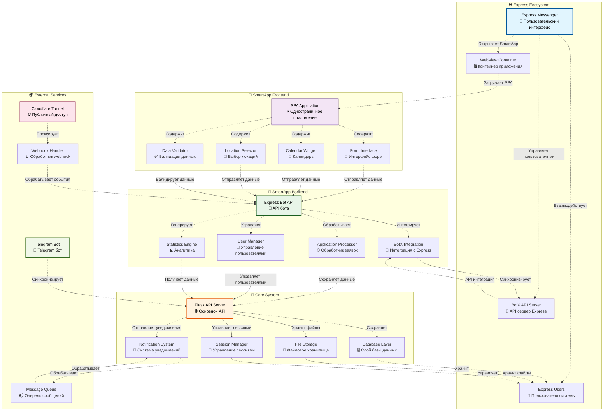
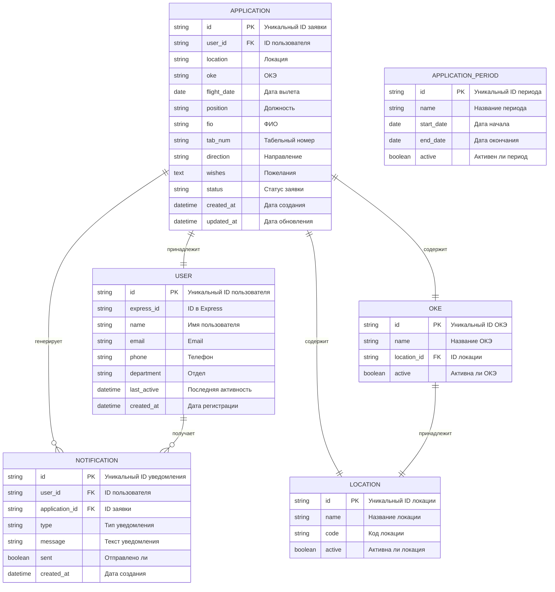
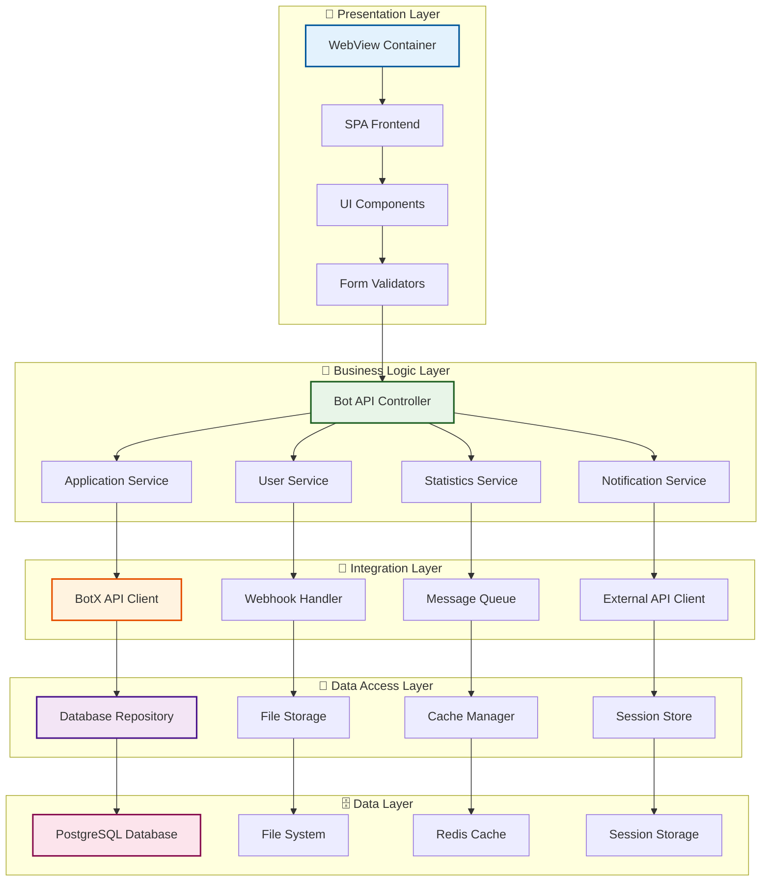
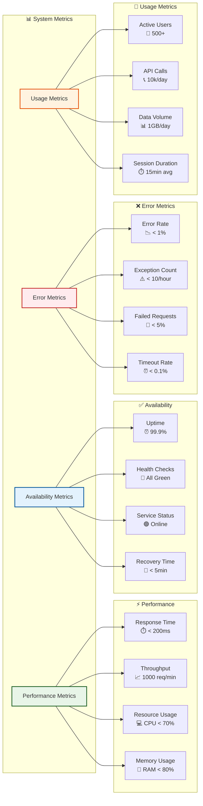
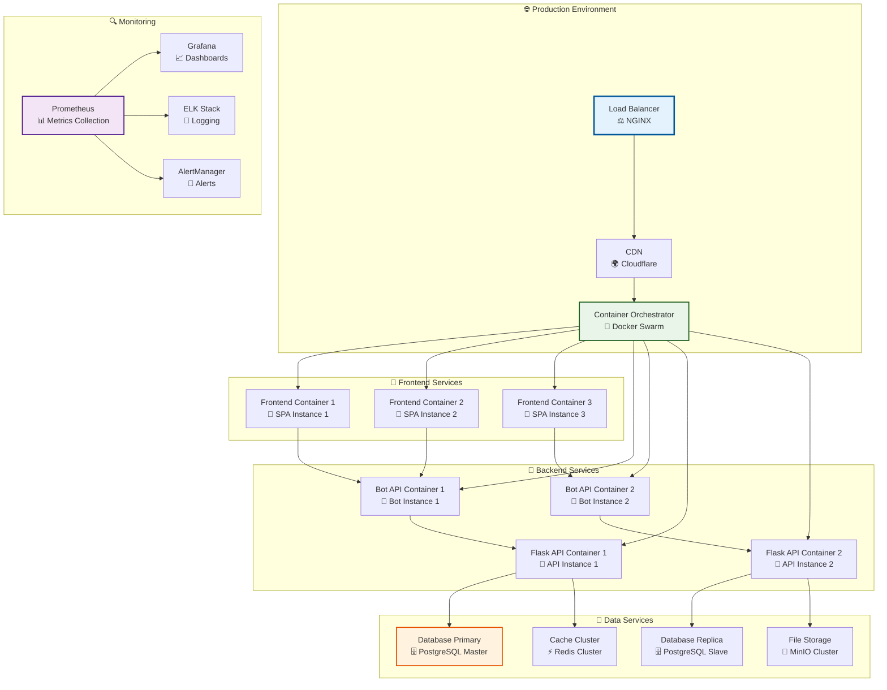

# 🎨 Express Bot - Интерактивные диаграммы

## 🚀 Системная архитектура

### Общая схема системы



---

## 🔄 Жизненный цикл заявки

### Полный процесс от создания до обработки

```mermaid
flowchart TD
    A[👤 Пользователь открывает SmartApp] --> B[🌐 WebView загружает SPA]
    B --> C[📱 Отображение главного меню]
    C --> D[📝 Выбор "Подать заявку"]
    D --> E[🏢 Выбор локации]
    E --> F[🏭 Выбор ОКЭ]
    F --> G[📅 Выбор даты через календарь]
    G --> H[👔 Выбор должности]
    H --> I[✍️ Ввод ФИО и табельного номера]
    I --> J[✈️ Выбор направления]
    J --> K[💭 Ввод пожеланий]
    K --> L[✅ Подтверждение данных]
    L --> M[📤 Отправка заявки]
    M --> N[🤖 Обработка через Bot API]
    N --> O[🔗 Интеграция с BotX API]
    O --> P[💾 Сохранение в базе данных]
    P --> Q[📧 Отправка уведомления]
    Q --> R[✅ Подтверждение пользователю]
    
    %% Обработка ошибок
    M --> S{❌ Ошибка отправки?}
    S -->|Да| T[🔄 Повторная попытка]
    S -->|Нет| N
    T --> U{🔄 Максимум попыток?}
    U -->|Нет| M
    U -->|Да| V[❌ Уведомление об ошибке]
    
    %% Стилизация
    style A fill:#e3f2fd,stroke:#01579b,stroke-width:2px
    style M fill:#e8f5e8,stroke:#1b5e20,stroke-width:2px
    style P fill:#fff3e0,stroke:#e65100,stroke-width:2px
    style R fill:#f3e5f5,stroke:#4a148c,stroke-width:2px
    style S fill:#ffebee,stroke:#c62828,stroke-width:2px
    style V fill:#ffebee,stroke:#c62828,stroke-width:2px
```

---

## 📊 Структура данных

### Модель данных заявки



---

## 🔧 Техническая архитектура

### Слоистая архитектура



---

## 📈 Производительность и мониторинг

### Метрики системы



---

## 🔐 Безопасность

### Модель безопасности

```mermaid
graph TB
    subgraph "🛡️ Security Layers"
        A[Network Security]
        B[Application Security]
        C[Data Security]
        D[Access Control]
    end
    
    subgraph "🌐 Network Layer"
        A1[Firewall<br/>🔥 Block malicious traffic]
        A2[SSL/TLS<br/>🔒 Encrypt connections]
        A3[VPN<br/>🔐 Secure tunnels]
        A4[DDoS Protection<br/>🛡️ Mitigate attacks]
    end
    
    subgraph "🔧 Application Layer"
        B1[JWT Tokens<br/>🎫 Authentication]
        B2[CORS Policy<br/>🌐 Cross-origin control]
        B3[Input Validation<br/>✅ Data sanitization]
        B4[Rate Limiting<br/>⏱️ Request throttling]
    end
    
    subgraph "💾 Data Layer"
        C1[Encryption at Rest<br/>🔐 Encrypt stored data]
        C2[Encryption in Transit<br/>🚀 Encrypt network data]
        C3[Backup Security<br/>💾 Secure backups]
        C4[Data Anonymization<br/>👤 Privacy protection]
    end
    
    subgraph "🔑 Access Control"
        D1[Role-Based Access<br/>👥 RBAC system]
        D2[Multi-Factor Auth<br/>🔐 MFA required]
        D3[Session Management<br/>⏰ Secure sessions]
        D4[Audit Logging<br/>📝 Track all actions]
    end
    
    A --> A1
    A --> A2
    A --> A3
    A --> A4
    
    B --> B1
    B --> B2
    B --> B3
    B --> B4
    
    C --> C1
    C --> C2
    C --> C3
    C --> C4
    
    D --> D1
    D --> D2
    D --> D3
    D --> D4
    
    %% Styling
    style A fill:#e3f2fd,stroke:#01579b,stroke-width:2px
    style B fill:#e8f5e8,stroke:#1b5e20,stroke-width:2px
    style C fill:#fff3e0,stroke:#e65100,stroke-width:2px
    style D fill:#f3e5f5,stroke:#4a148c,stroke-width:2px
```



---

## 🚀 Развертывание

### Схема развертывания



---

## 🏷️ Теги и категории

#diagrams #interactive #architecture #visualization #mermaid #system-design #express #bot #smartapp #frontend #backend #api #database #security #monitoring #deployment

---

*Создано: 2025-01-27*  
*Версия: 1.0*  
*Статус: ✅ Активный*


