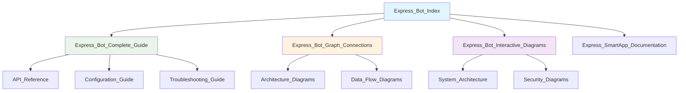

# 🎨 Obsidian Setup для Express Bot

## 📋 Настройка Obsidian для работы с документацией

### 🔧 Необходимые плагины

Для корректного отображения всех диаграмм и функций рекомендуется установить следующие плагины:

#### Обязательные плагины
1. **Mermaid** - для отображения диаграмм
2. **Graph View** - для навигации по связям
3. **Search** - для поиска по документации
4. **File Explorer** - для навигации по файлам

#### Дополнительные плагины
1. **Dataview** - для динамических таблиц
2. **Templater** - для шаблонов
3. **Calendar** - для отслеживания изменений
4. **Tag Wrangler** - для управления тегами

### ⚙️ Настройки Mermaid

```yaml
# В настройках Obsidian -> Mermaid
mermaid:
  theme: default
  themeVariables:
    primaryColor: '#e1f5fe'
    primaryTextColor: '#000000'
    primaryBorderColor: '#01579b'
    lineColor: '#01579b'
    secondaryColor: '#f3e5f5'
    tertiaryColor: '#e8f5e8'
```

### 🎨 Настройки темы

Рекомендуется использовать светлую тему для лучшего отображения диаграмм:

```css
/* Custom CSS для Express Bot документации */
.theme-light {
  --text-normal: #2c3e50;
  --text-muted: #7f8c8d;
  --background-primary: #ffffff;
  --background-secondary: #f8f9fa;
  --accent-color: #667eea;
}

/* Стилизация для Mermaid диаграмм */
.mermaid {
  background: #ffffff;
  border-radius: 8px;
  padding: 16px;
  box-shadow: 0 2px 8px rgba(0,0,0,0.1);
}
```

---

## 📁 Структура файлов в Obsidian

### 🗂️ Организация папок

```
Express Bot Documentation/
├── 📚 Main Documentation/
│   ├── Express_Bot_Index.md
│   ├── Express_Bot_Complete_Guide.md
│   ├── Express_Bot_Graph_Connections.md
│   └── Express_Bot_Interactive_Diagrams.md
│
├── 📱 SmartApp Documentation/
│   ├── Express_SmartApp_Documentation.md
│   ├── Frontend_Guide.md
│   └── Backend_Guide.md
│
├── 🔧 Technical Reference/
│   ├── API_Reference.md
│   ├── Configuration_Guide.md
│   └── Troubleshooting_Guide.md
│
├── 📊 Diagrams/
│   ├── Architecture_Diagrams.md
│   ├── Data_Flow_Diagrams.md
│   └── Security_Diagrams.md
│
└── 📝 Templates/
    ├── Issue_Template.md
    ├── Feature_Request_Template.md
    └── Documentation_Template.md
```

### 🏷️ Система тегов

```yaml
# Основные категории
categories:
  - "#express"           # Express Platform
  - "#bot"              # Bot functionality
  - "#smartapp"         # SmartApp features
  - "#api"              # API documentation
  - "#frontend"         # Frontend components
  - "#backend"          # Backend components
  - "#documentation"    # Documentation
  - "#guide"            # User guides
  - "#technical"        # Technical reference
  - "#architecture"     # System architecture
  - "#diagrams"         # Visual diagrams
  - "#troubleshooting"  # Problem solving
  - "#monitoring"       # System monitoring
  - "#security"         # Security aspects
  - "#performance"      # Performance optimization
```

---

## 🔗 Навигация и связи

### 📊 Граф связей

В Obsidian можно создать граф связей между документами:



### 🔍 Поиск и фильтрация

Используйте теги для быстрого поиска:

- `#express` - все документы по Express Platform
- `#api` - API документация
- `#troubleshooting` - решение проблем
- `#architecture` - архитектурные диаграммы

---

## 📱 Мобильная версия

### 📲 Настройки для мобильных устройств

```yaml
# Настройки для мобильной версии
mobile:
  mermaid:
    theme: dark
    fontSize: 14px
  view:
    showLineNumbers: false
    showVaultName: true
  sync:
    autoSync: true
    conflictResolution: "local"
```

### 🎨 Адаптивные стили

```css
/* Мобильные стили */
@media (max-width: 768px) {
  .mermaid {
    font-size: 12px;
    padding: 8px;
  }
  
  .table-wrapper {
    overflow-x: auto;
  }
  
  .callout {
    margin: 8px 0;
    padding: 12px;
  }
}
```

---

## 🔧 Продвинутые настройки

### 📊 Dataview запросы

```javascript
// Список всех документов с тегом #express
TABLE file.name, file.mtime
FROM ""
WHERE contains(file.tags, "#express")
SORT file.mtime DESC

// Статистика по тегам
TABLE length(rows) as "Count"
FROM ""
GROUP BY file.tags
SORT "Count" DESC
```

### 🎨 Кастомные CSS

```css
/* Стилизация для Express Bot документации */
.callout[data-callout="express"] {
  border-left: 4px solid #667eea;
  background: #f8f9ff;
}

.callout[data-callout="bot"] {
  border-left: 4px solid #28a745;
  background: #f8fff9;
}

.callout[data-callout="api"] {
  border-left: 4px solid #ffc107;
  background: #fffdf8;
}

/* Стилизация таблиц */
table {
  border-collapse: collapse;
  width: 100%;
  margin: 16px 0;
}

th, td {
  border: 1px solid #ddd;
  padding: 8px 12px;
  text-align: left;
}

th {
  background-color: #f8f9fa;
  font-weight: 600;
}

/* Стилизация кода */
code {
  background: #f8f9fa;
  padding: 2px 4px;
  border-radius: 3px;
  font-family: 'Fira Code', monospace;
}

pre {
  background: #f8f9fa;
  padding: 16px;
  border-radius: 8px;
  overflow-x: auto;
}
```

---

## 📚 Шаблоны документов

### 📝 Шаблон для новых документов

```markdown
# 📋 [Название документа]

## 📋 Обзор
Краткое описание документа

## 🎯 Цели
- Цель 1
- Цель 2
- Цель 3

## 📊 Содержание
- [Раздел 1](#раздел-1)
- [Раздел 2](#раздел-2)
- [Раздел 3](#раздел-3)

## 🔗 Связанные документы
- [[Связанный документ 1]]
- [[Связанный документ 2]]

## 🏷️ Теги
#тег1 #тег2 #тег3

---
*Создано: $(date)*
*Версия: 1.0*
```

### 🐛 Шаблон для багов

```markdown
# 🐛 [Название бага]

## 📋 Описание
Подробное описание проблемы

## 🔄 Шаги воспроизведения
1. Шаг 1
2. Шаг 2
3. Шаг 3

## ✅ Ожидаемое поведение
Что должно происходить

## ❌ Фактическое поведение
Что происходит на самом деле

## 🔧 Окружение
- ОС: 
- Браузер: 
- Версия: 

## 📊 Приоритет
- [ ] Низкий
- [ ] Средний
- [ ] Высокий
- [ ] Критический

## 🏷️ Теги
#bug #troubleshooting #priority
```

---

## 🚀 Автоматизация

### ⚡ Горячие клавиши

```yaml
# Рекомендуемые горячие клавиши
hotkeys:
  "Ctrl+Shift+D": "Toggle Mermaid diagram"
  "Ctrl+Shift+G": "Open graph view"
  "Ctrl+Shift+S": "Search in vault"
  "Ctrl+Shift+T": "Open tag panel"
  "Ctrl+Shift+N": "Create new note"
```

### 🔄 Автоматические действия

```javascript
// Автоматическое обновление даты
// В настройках Templater
<% tp.date.now("YYYY-MM-DD") %>

// Автоматическое создание ссылок
// В настройках Auto Link
[[<% tp.file.title %>]]

// Автоматическое добавление тегов
// В настройках Tag Wrangler
#express #bot #documentation
```

---

## 📊 Мониторинг документации

### 📈 Метрики

```javascript
// Dataview запрос для отслеживания активности
TABLE file.name, file.mtime, file.size
FROM ""
WHERE file.mtime >= date(today) - dur(7 days)
SORT file.mtime DESC
```

### 🔍 Анализ связей

```javascript
// Анализ связей между документами
TABLE length(file.outlinks) as "Outgoing Links", length(file.inlinks) as "Incoming Links"
FROM ""
WHERE file.name != "Express_Bot_Index"
SORT "Outgoing Links" DESC
```

---

## 🏷️ Теги и категории

#obsidian #setup #configuration #mermaid #diagrams #navigation #templates #automation #mobile #css #styling

---

*Создано: 2025-01-27*  
*Версия: 1.0*  
*Статус: ✅ Готов к использованию*


