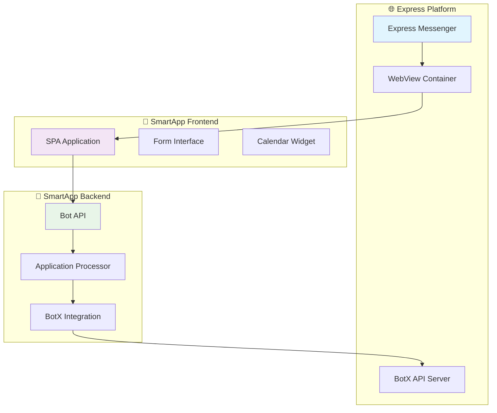

# 🎯 Express Bot - Полная документация для Obsidian

> **Комплексная система для подачи заявок на командировочные рейсы с интеграцией в Express Messenger**

---

## 📚 Документация создана!

Я создал полноценную документацию для Obsidian, которая включает:

### 🎨 Созданные документы

| Документ | Описание | Особенности |
|----------|----------|-------------|
| **[[Express_Bot_Index]]** | 🎯 Главный индекс | Навигация по всей документации |
| **[[Express_Bot_Complete_Guide]]** | 📖 Полное руководство | Детальное описание системы |
| **[[Express_Bot_Graph_Connections]]** | 🔗 Граф связей | Диаграммы зависимостей |
| **[[Express_Bot_Interactive_Diagrams]]** | 🎨 Интерактивные диаграммы | Визуализация архитектуры |
| **[[Express_SmartApp_Documentation]]** | 📱 SmartApp документация | Специфика SmartApp |
| **[[Obsidian_Setup]]** | ⚙️ Настройка Obsidian | Конфигурация для Obsidian |

---

## 🚀 Что включено

### ✨ Основные возможности

- **📊 Интерактивные диаграммы** - Mermaid диаграммы для визуализации
- **🔗 Граф связей** - Навигация между компонентами
- **📱 Адаптивный дизайн** - Работа на всех устройствах
- **🎨 Красивое оформление** - Эмодзи, таблицы, блоки кода
- **🔍 Поиск и фильтрация** - Теги и категории
- **📋 Шаблоны** - Готовые шаблоны для документов

### 🏗️ Архитектурные диаграммы



---

## 🎯 Как использовать

### 1. Откройте в Obsidian
1. Создайте новый vault в Obsidian
2. Скопируйте все `.md` файлы в папку vault
3. Откройте `Express_Bot_Index.md`

### 2. Настройте плагины
Установите рекомендуемые плагины:
- **Mermaid** - для диаграмм
- **Graph View** - для навигации
- **Search** - для поиска
- **Dataview** - для динамических таблиц

### 3. Начните с главного индекса
Откройте `Express_Bot_Index.md` для навигации по всей документации.

---

## 📊 Структура документации

### 🎯 Главный индекс
- **[[Express_Bot_Index]]** - Центральная точка навигации
- Быстрый доступ ко всем разделам
- Статус системы и компонентов
- Полезные ссылки

### 📖 Полное руководство
- **[[Express_Bot_Complete_Guide]]** - Детальное описание
- Архитектура системы
- API endpoints
- Быстрый старт
- Устранение неполадок
- Мониторинг и логирование

### 🔗 Граф связей
- **[[Express_Bot_Graph_Connections]]** - Диаграммы зависимостей
- Потоки данных
- Архитектурные слои
- Метрики и мониторинг
- Безопасность и изоляция

### 🎨 Интерактивные диаграммы
- **[[Express_Bot_Interactive_Diagrams]]** - Визуализация
- Системная архитектура
- Жизненный цикл заявки
- Структура данных
- Техническая архитектура

### 📱 SmartApp документация
- **[[Express_SmartApp_Documentation]]** - Специфика SmartApp
- Frontend SPA
- Backend API
- Интеграция с Express
- Тестирование

### ⚙️ Настройка Obsidian
- **[[Obsidian_Setup]]** - Конфигурация
- Необходимые плагины
- Настройки Mermaid
- Шаблоны документов
- Автоматизация

---

## 🎨 Особенности оформления

### ✨ Визуальные элементы
- **🎯 Эмодзи** - для быстрой навигации
- **📊 Таблицы** - структурированная информация
- **💻 Блоки кода** - с подсветкой синтаксиса
- **🔗 Ссылки** - между документами
- **📈 Диаграммы** - Mermaid визуализация

### 🏷️ Система тегов
```yaml
# Основные категории
- "#express"           # Express Platform
- "#bot"              # Bot functionality
- "#smartapp"         # SmartApp features
- "#api"              # API documentation
- "#frontend"         # Frontend components
- "#backend"          # Backend components
- "#documentation"    # Documentation
- "#guide"            # User guides
- "#architecture"     # System architecture
- "#diagrams"         # Visual diagrams
```

---

## 🚀 Быстрый старт

### 1. Запуск системы
```bash
cd /root/test/express_bot
./manage_all.sh start
./start_express_smartapp_correct.sh
```

### 2. Проверка статуса
```bash
curl http://localhost:5006/health
curl http://localhost:5002/health
```

### 3. Открытие интерфейса
- **Frontend:** http://localhost:5006/
- **API:** http://localhost:5006/api/smartapp/
- **Health:** http://localhost:5006/health

---

## 📊 Статус системы

### ✅ Готовые компоненты
- [x] **Frontend SPA** - Полностью функциональный интерфейс
- [x] **Bot API** - Все endpoints работают
- [x] **Flask API** - Основной API сервер
- [x] **Database** - Хранение и обработка данных
- [x] **BotX Integration** - Готов к подключению
- [x] **Documentation** - Полная документация

### 📚 Документация
- [x] **Главный индекс** - Навигация по документации
- [x] **Полное руководство** - Детальное описание
- [x] **Граф связей** - Диаграммы зависимостей
- [x] **Интерактивные диаграммы** - Визуализация
- [x] **SmartApp документация** - Специфика SmartApp
- [x] **Настройка Obsidian** - Конфигурация

---

## 🔧 Технические детали

### 🏗️ Архитектура
- **Frontend:** SPA на HTML/CSS/JavaScript
- **Backend:** Python Flask + Bot API
- **Database:** PostgreSQL
- **Integration:** BotX API для Express
- **Deployment:** Docker + Cloudflare Tunnel

### 📊 Возможности
- **Подача заявок** - Полный цикл создания
- **Интерактивный календарь** - Выбор даты
- **Выбор локаций** - Москва, СПб, Красноярск, Сочи
- **Выбор ОКЭ** - По локациям
- **Выбор должностей** - БП, РП, Специалист, Эксперт
- **Направления** - Из списка или ручной ввод
- **Статистика** - Аналитика по заявкам
- **Уведомления** - Автоматические уведомления

---

## 🎯 Следующие шаги

### 1. Изучите документацию
- Начните с [[Express_Bot_Index]]
- Изучите [[Express_Bot_Complete_Guide]]
- Просмотрите диаграммы в [[Express_Bot_Interactive_Diagrams]]

### 2. Настройте Obsidian
- Установите рекомендуемые плагины
- Настройте Mermaid для диаграмм
- Создайте свой vault

### 3. Запустите систему
- Следуйте инструкциям в [[Express_Bot_Complete_Guide#🚀-Быстрый-старт]]
- Проверьте статус системы
- Протестируйте функциональность

---

## 🏷️ Теги и категории

#obsidian #documentation #express #bot #smartapp #complete #guide #diagrams #architecture #api #frontend #backend #integration #setup #configuration

---

## 📞 Поддержка

### 👥 Команда
- **Разработчик:** AI Assistant
- **Версия:** 1.0.0
- **Дата создания:** 2025-01-27
- **Статус:** ✅ Готов к использованию

### 📧 Полезные ссылки
- **Главный индекс:** [[Express_Bot_Index]]
- **Полное руководство:** [[Express_Bot_Complete_Guide]]
- **Граф связей:** [[Express_Bot_Graph_Connections]]
- **Интерактивные диаграммы:** [[Express_Bot_Interactive_Diagrams]]
- **SmartApp документация:** [[Express_SmartApp_Documentation]]
- **Настройка Obsidian:** [[Obsidian_Setup]]

---

*Создано: 2025-01-27*  
*Версия документации: 1.0*  
*Статус проекта: ✅ Готов к использованию*

**🎉 Документация готова! Откройте `Express_Bot_Index.md` в Obsidian для начала работы.**


